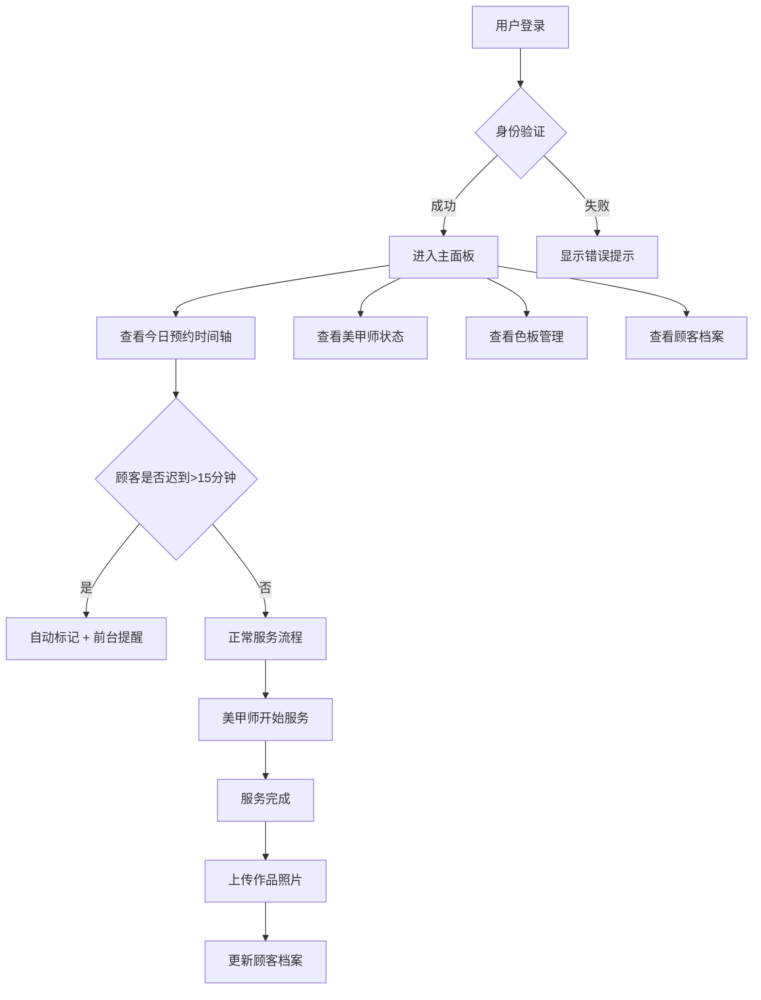

## 1. 产品概述

本产品是一款专业的美甲店运营管理面板，为美甲店提供一站式的日常运营管理解决方案。通过数字化手段提升预约管理、员工调度、库存管理和客户服务效率，帮助店主实现精细化运营。

- 目标用户：美甲店店主、店长、前台接待、美甲师
- 核心价值：提升运营效率、优化客户体验、降低管理成本、增加营收

## 2. 核心功能

### 2.1 用户角色

| 角色 | 登录方式 | 核心权限 |
|------|----------|----------|
| 店主/店长 | 账号密码登录 | 全部功能权限，查看营业数据，管理员工和库存 |
| 前台接待 | 账号密码登录 | 预约管理、顾客档案管理、色板查看 |
| 美甲师 | 账号密码登录 | 查看个人日程、服务状态、顾客档案 |

### 2.2 功能模块

1. **登录认证页面**：用户登录、身份验证、权限控制
2. **今日预约时间轴**：时间轴展示、预约详情、迟到提醒
3. **美甲师状态管理**：实时状态、服务统计、业绩展示
4. **色板管理**：色号展示、智能标签、库存状态
5. **顾客档案与作品管理**：顾客信息、作品图片、历史记录

### 2.3 页面详情

| 页面名称 | 模块名称 | 功能描述 |
|---------|---------|---------|
| 登录页面 | 登录表单 | 账号密码输入、记住密码、登录验证、错误提示 |
| 登录页面 | 品牌展示 | Logo展示、店铺名称、品牌背景装饰 |
| 主面板 - 今日预约 | 时间轴 | 9:00-21:00半小时间隔时间格、预约卡片展示 |
| 主面板 - 今日预约 | 预约卡片 | 顾客姓名、服务项目、美甲师、状态标识 |
| 主面板 - 今日预约 | 迟到提醒 | 超过15分钟自动标红、弹窗提醒前台确认 |
| 主面板 - 美甲师状态 | 状态卡片 | 头像、姓名、当前状态（空闲/服务中/休息/已下班） |
| 主面板 - 美甲师状态 | 实时统计 | 今日完成单数、累计服务金额 |
| 主面板 - 色板管理 | 色号网格 | 品牌分类、色块展示、色号名称 |
| 主面板 - 色板管理 | 智能标签 | 本月热门（金色标签）、补货中（橙色标签）、已过期（灰色禁用） |
| 主面板 - 顾客档案 | 顾客列表 | 搜索、筛选、顾客卡片（头像、姓名、电话） |
| 主面板 - 顾客档案 | 作品管理 | 成品图上传、作品画廊、与服务记录关联 |
| 主面板 - 顾客档案 | 历史记录 | 服务历史、消费记录、备注信息 |

## 3. 核心流程

### 3.1 主要用户流程描述

**前台日常工作流程**：
前台登录系统 → 查看今日预约时间轴 → 顾客到店确认预约 → 安排空闲美甲师 → 服务完成后上传作品照片 → 更新顾客档案

**美甲师工作流程**：
美甲师登录系统 → 查看个人今日排班 → 开始服务更新状态 → 服务完成 → 查看当日业绩统计

**迟到提醒流程**：
系统实时检测预约时间 → 顾客迟到超过15分钟 → 自动标记预约为"迟到"状态 → 触发前台弹窗提醒 → 前台电话联系顾客确认

### 3.2 核心流程图

## 4. 用户界面设计

### 4.1 设计风格

**整体风格定位**：优雅精致的现代轻奢风格，融合美甲行业的柔美气质与专业管理系统的高效简洁。

- **主色调**：玫瑰金 (#D4A574) 作为品牌主色，传递优雅与品质感
- **辅助色**：
  - 柔粉 (#F8E8EC) 用于背景和装饰
  - 深紫 (#4A3728) 用于文字和强调
  - 薄荷绿 (#A8D8D0) 用于"空闲"等正向状态
  - 珊瑚红 (#E88A7F) 用于"迟到"等警示状态
- **中性色**：米白 (#FAF7F5) 背景、暖灰 (#8B7D75) 次级文字
- **按钮风格**：圆角设计 (border-radius: 12px)，轻微阴影，悬浮时有微妙的上浮动画
- **字体**：标题使用 Playfair Display（优雅衬线体），正文使用 Noto Sans SC（简洁易读）
- **布局风格**：卡片式布局，合理留白，精致边框，柔和阴影
- **图标风格**：线性图标配合渐变填充，统一圆角设计

### 4.2 页面设计概述

| 页面名称 | 模块名称 | UI元素设计 |
|---------|---------|-----------|
| 登录页面 | 登录表单 | 半透明毛玻璃卡片、玫瑰金渐变按钮、输入框聚焦时发光效果、品牌装饰元素 |
| 登录页面 | 品牌展示 | 左侧大幅背景图（优雅美甲作品）、Logo动画展示、店铺slogan |
| 主面板 | 顶部导航 | 面包屑导航、通知铃铛、用户头像下拉菜单、深色/浅色切换 |
| 主面板 | 侧边栏 | 渐变色导航项、图标+文字、当前页面高亮指示、可收起功能 |
| 主面板 | 预约时间轴 | 时间刻度竖线、渐变背景时间格、预约卡片悬浮放大、迟到卡片呼吸红色光效 |
| 主面板 | 美甲师状态 | 圆形头像带状态指示环、状态颜色标签、数据数字渐入动画 |
| 主面板 | 色板管理 | 网格布局色块、悬浮放大预览、标签徽章、过期色号灰色蒙版 |
| 主面板 | 顾客档案 | 瀑布流作品画廊、图片上传进度条、卡片悬浮展示详情 |

### 4.3 响应式设计

- **桌面端优先**：设计基准宽度 1440px，优化大屏展示效果
- **平板适配**：≥1024px，侧边栏可收起为图标模式，内容区域自适应
- **手机适配**：≥768px，底部导航替代侧边栏，时间轴改为横向滚动，卡片单列排布
- **触摸优化**：按钮最小高度 48px，手势滑动支持时间轴浏览

## 5. 动画与交互设计

### 5.1 页面加载动画
- 首屏加载时 Logo 淡入放大
- 内容区块依次渐入（stagger 延迟 50ms）
- 骨架屏占位到实际内容的平滑过渡

### 5.2 微交互动画
- 按钮悬浮：轻微上移 (translateY -2px) + 阴影加深
- 卡片悬浮：边框高亮 + 阴影扩散
- 状态变化：颜色渐变过渡 (300ms ease)
- 迟到提醒：红色呼吸光效 + 轻微震动

### 5.3 数据更新动画
- 数字变化：滚动计数动画
- 新增预约：从右侧滑入
- 状态切换：圆形进度指示动画
