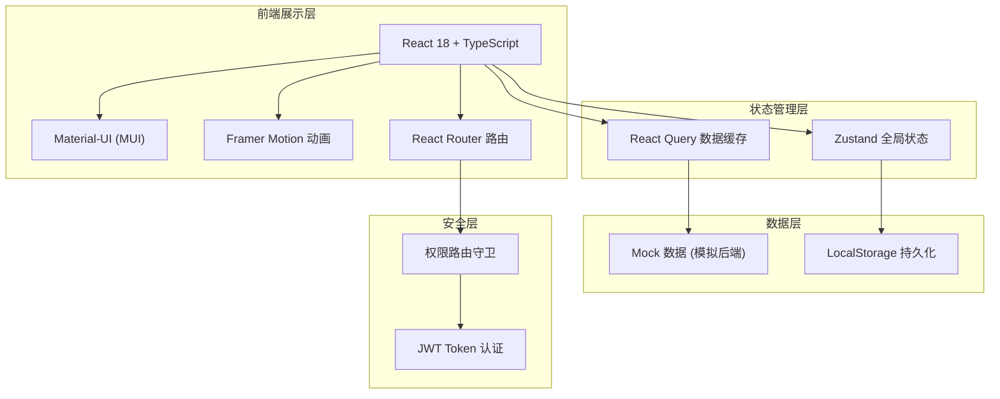

## 1. 架构设计



## 2. 技术说明

### 2.1 前端技术栈

| 技术 | 版本 | 用途 |
|------|------|------|
| React | 18.x | UI 构建库 |
| TypeScript | 5.x | 类型安全 |
| Vite | 5.x | 构建工具与开发服务器 |
| Material-UI | 5.x | UI 组件库 |
| @emotion/react | 11.x | CSS-in-JS 样式方案（MUI 依赖） |
| @emotion/styled | 11.x | 样式化组件 |
| react-router-dom | 6.x | 客户端路由 |
| zustand | 4.x | 轻量状态管理 |
| framer-motion | 11.x | 动画库 |
| lucide-react | 0.x | 图标库 |
| date-fns | 3.x | 日期时间处理 |

### 2.2 项目初始化方案

- **初始化工具**：使用 Vite + React + TypeScript 模板
- **包管理器**：优先使用 pnpm，回退 npm

## 3. 路由定义

| 路由路径 | 页面组件 | 权限要求 | 说明 |
|---------|---------|---------|------|
| `/login` | `LoginPage` | 公开 | 登录认证页面 |
| `/dashboard` | `DashboardPage` | 已登录 | 主面板（默认展示今日预约） |
| `/dashboard/appointments` | `AppointmentsPage` | 已登录 | 预约时间轴管理 |
| `/dashboard/technicians` | `TechniciansPage` | 已登录 | 美甲师状态管理 |
| `/dashboard/color-palette` | `ColorPalettePage` | 已登录 | 色板管理 |
| `/dashboard/customers` | `CustomersPage` | 已登录 | 顾客档案与作品管理 |
| `*` | `NotFoundPage` | 公开 | 404 页面 |

## 4. 数据模型与类型定义

### 4.1 核心类型定义

```typescript
// 用户角色
type UserRole = 'owner' | 'receptionist' | 'technician';

// 用户
interface User {
  id: string;
  username: string;
  name: string;
  role: UserRole;
  avatar: string;
  phone?: string;
}

// 服务项目类型
type ServiceType = 'manicure' | 'eyelash' | 'removal' | 'extension' | 'correction' | 'pedicure';

interface ServiceItem {
  id: string;
  type: ServiceType;
  name: string;
  duration: number; // 分钟
  price: number;
}

// 美甲师状态
type TechnicianStatus = 'idle' | 'serving' | 'break' | 'off';

interface Technician {
  id: string;
  name: string;
  avatar: string;
  status: TechnicianStatus;
  todayCompletedCount: number;
  todayRevenue: number;
}

// 预约状态
type AppointmentStatus = 'pending' | 'confirmed' | 'arrived' | 'serving' | 'completed' | 'cancelled' | 'late';

interface Appointment {
  id: string;
  customerId: string;
  customerName: string;
  customerPhone: string;
  serviceId: string;
  serviceName: string;
  serviceType: ServiceType;
  technicianId: string;
  technicianName: string;
  startTime: string; // HH:mm 格式
  endTime: string;
  date: string; // YYYY-MM-DD
  status: AppointmentStatus;
  isLate: boolean;
  lateMinutes?: number;
  notes?: string;
}

// 色板标签
type ColorTag = 'hot' | 'restocking' | 'expired';

interface ColorSwatch {
  id: string;
  brand: string;
  code: string;
  name: string;
  hexColor: string;
  tags: ColorTag[];
  inStock: boolean;
  expiryDate?: string;
}

// 顾客档案
interface Customer {
  id: string;
  name: string;
  phone: string;
  avatar: string;
  gender: 'female' | 'male';
  birthday?: string;
  firstVisit: string;
  totalVisits: number;
  totalSpent: number;
  notes?: string;
}

// 作品图片
interface WorkPhoto {
  id: string;
  customerId: string;
  appointmentId?: string;
  imageUrl: string;
  serviceType: ServiceType;
  createdAt: string;
  description?: string;
}
```

### 4.2 状态管理设计 (Zustand Store)

```typescript
// authStore - 认证状态
interface AuthState {
  user: User | null;
  token: string | null;
  isAuthenticated: boolean;
  login: (username: string, password: string) => Promise<boolean>;
  logout: () => void;
}

// appointmentStore - 预约数据
interface AppointmentState {
  appointments: Appointment[];
  selectedDate: string;
  lateAppointments: string[]; // 迟到预约ID
  setSelectedDate: (date: string) => void;
  addAppointment: (apt: Appointment) => void;
  updateStatus: (id: string, status: AppointmentStatus) => void;
  checkLateAppointments: () => void;
}

// technicianStore - 美甲师状态
interface TechnicianState {
  technicians: Technician[];
  updateTechnicianStatus: (id: string, status: TechnicianStatus) => void;
  incrementCompletedCount: (id: string, revenue: number) => void;
}

// colorPaletteStore - 色板管理
interface ColorPaletteState {
  colors: ColorSwatch[];
  selectedBrand: string | null;
  setSelectedBrand: (brand: string | null) => void;
}

// customerStore - 顾客档案
interface CustomerState {
  customers: Customer[];
  workPhotos: WorkPhoto[];
  selectedCustomer: Customer | null;
  addWorkPhoto: (photo: WorkPhoto) => void;
  setSelectedCustomer: (customer: Customer | null) => void;
}
```

## 5. 目录结构设计

```
src/
├── components/           # 可复用组件
│   ├── layout/          # 布局组件
│   │   ├── AppLayout.tsx
│   │   ├── Sidebar.tsx
│   │   ├── Header.tsx
│   │   └── ProtectedRoute.tsx
│   ├── appointments/    # 预约相关组件
│   │   ├── Timeline.tsx
│   │   ├── TimelineSlot.tsx
│   │   ├── AppointmentCard.tsx
│   │   └── LateAlertModal.tsx
│   ├── technicians/     # 美甲师相关组件
│   │   ├── TechnicianCard.tsx
│   │   └── TechnicianStatusBadge.tsx
│   ├── color-palette/   # 色板相关组件
│   │   ├── ColorGrid.tsx
│   │   ├── ColorSwatchCard.tsx
│   │   └── ColorTagBadge.tsx
│   ├── customers/       # 顾客相关组件
│   │   ├── CustomerCard.tsx
│   │   ├── CustomerDetail.tsx
│   │   ├── WorkGallery.tsx
│   │   └── PhotoUploader.tsx
│   └── ui/              # 通用 UI 组件
│       ├── AnimatedCounter.tsx
│       ├── GradientButton.tsx
│       └── GlassCard.tsx
├── pages/               # 页面组件
│   ├── LoginPage.tsx
│   ├── DashboardPage.tsx
│   ├── AppointmentsPage.tsx
│   ├── TechniciansPage.tsx
│   ├── ColorPalettePage.tsx
│   ├── CustomersPage.tsx
│   └── NotFoundPage.tsx
├── store/               # Zustand 状态管理
│   ├── authStore.ts
│   ├── appointmentStore.ts
│   ├── technicianStore.ts
│   ├── colorPaletteStore.ts
│   └── customerStore.ts
├── types/               # TypeScript 类型定义
│   └── index.ts
├── data/                # Mock 数据
│   └── mockData.ts
├── utils/               # 工具函数
│   ├── dateUtils.ts
│   ├── authUtils.ts
│   └── colorUtils.ts
├── hooks/               # 自定义 Hooks
│   ├── useRealtimeClock.ts
│   ├── useLateDetection.ts
│   └── useAnimatedNumber.ts
├── theme/               # MUI 主题配置
│   ├── theme.ts
│   └── themeOptions.ts
├── App.tsx
├── main.tsx
└── index.css
```

## 6. 主题与样式设计

### 6.1 MUI 主题配置

```typescript
// 主题配色方案
const themeColors = {
  primary: {
    main: '#D4A574',      // 玫瑰金
    light: '#E8C9A0',
    dark: '#B88B5A',
  },
  secondary: {
    main: '#F8E8EC',      // 柔粉
    light: '#FCF4F6',
    dark: '#E8CCD3',
  },
  success: {
    main: '#A8D8D0',      // 薄荷绿
    light: '#D0EBE6',
    dark: '#7CC0B5',
  },
  warning: {
    main: '#E8A87F',      // 暖橙
  },
  error: {
    main: '#E88A7F',      // 珊瑚红
    light: '#F5C4BE',
  },
  text: {
    primary: '#4A3728',   // 深棕
    secondary: '#8B7D75', // 暖灰
  },
  background: {
    default: '#FAF7F5',   // 米白
    paper: '#FFFFFF',
  },
};

// 字体配置
// - Playfair Display: 标题展示字体
// - Noto Sans SC: 正文字体
```

## 7. 安全设计

### 7.1 身份认证
- 登录成功后生成模拟 JWT Token 存储于 LocalStorage
- 请求通过 Authorization Header 携带 Token
- Token 过期自动跳转登录页

### 7.2 权限控制
- 路由守卫 `ProtectedRoute` 检查认证状态
- 基于角色的功能按钮显示控制
- 敏感操作二次确认机制

### 7.3 数据安全
- 敏感信息（手机号）脱敏展示
- 本地存储数据加密（可选）
- 输入验证与 XSS 防护
